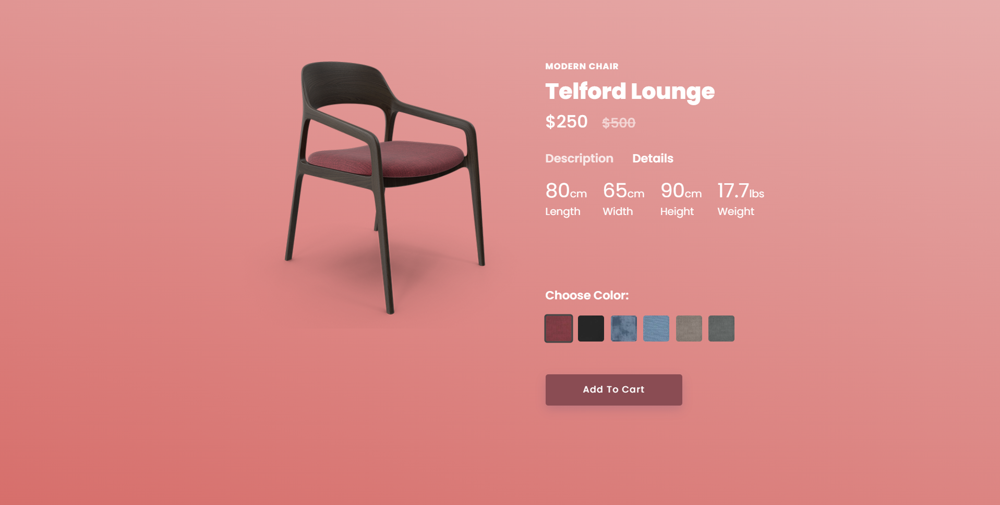

# 🪑 Modern Chair Website

Welcome to the **Modern Chair Website** – a clean and responsive homepage built using **HTML** and **CSS** only.

This project showcases a modern chair product with a smooth **color-changing feature**. When the user selects a different color option, the following elements update dynamically:

- ✅ Chair image  
- 🎨 Background color  
- 🔘 Button color  

---

## 🚀 Live Demo

> (Optional) Add your GitHub Pages or live site link here:  
> [🌐 View Live](https://modern-chair-homepage.netlify.app/)

---

## 📸 Preview

  
*Replace this with a real screenshot of your homepage.*

---

## 🧰 Technologies Used

- **HTML5** – Semantic and structured content
- **CSS3** – Styling, layout, and color transition effects
- **Responsive Design** – Works well on desktop, tablet, and mobile

> No JavaScript is used. All dynamic effects are done purely with HTML and CSS.

---

## 💡 Features

- 🎨 **Color Selection Panel**  
  Choose from multiple chair colors — the chair, background, and button update accordingly.

- 📱 **Responsive Design**  
  Mobile-first design ensures the layout adjusts to all screen sizes.

- ✨ **Smooth Transitions**  
  CSS transitions create a visually appealing and modern user experience.

---

## 📁 Folder Structure

